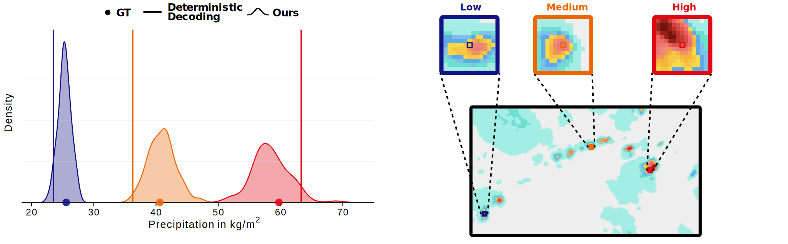
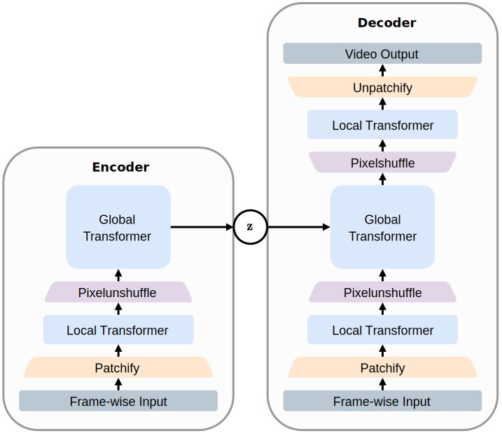
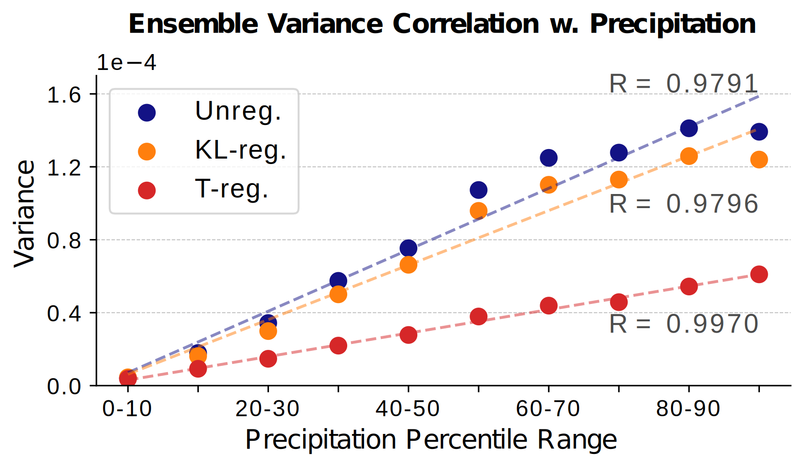
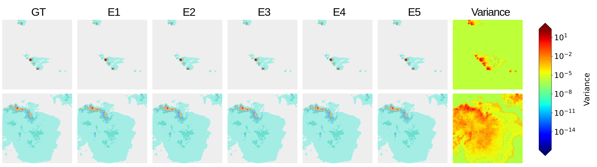
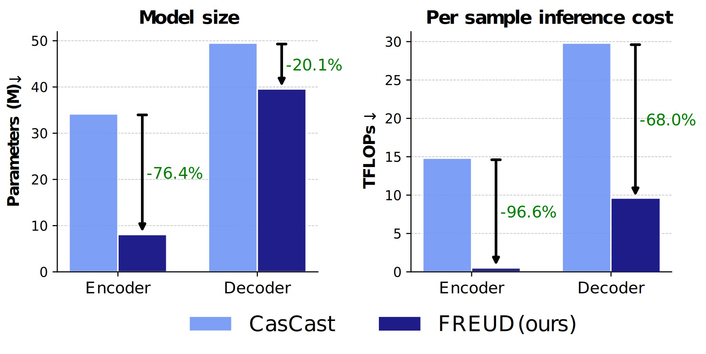
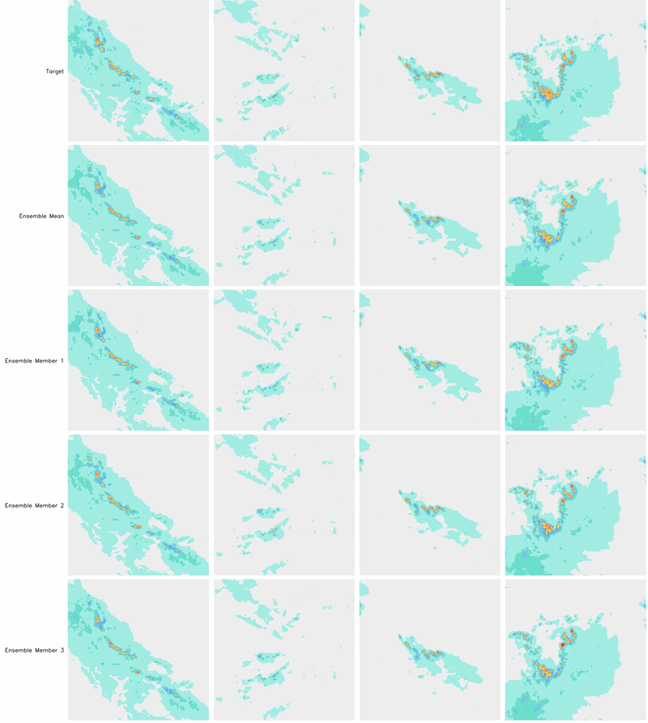
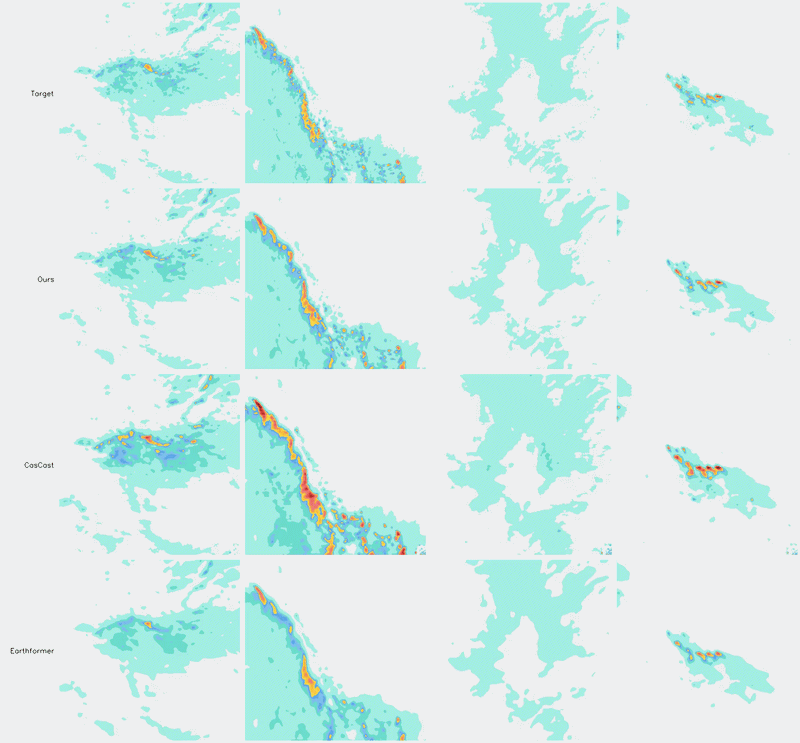
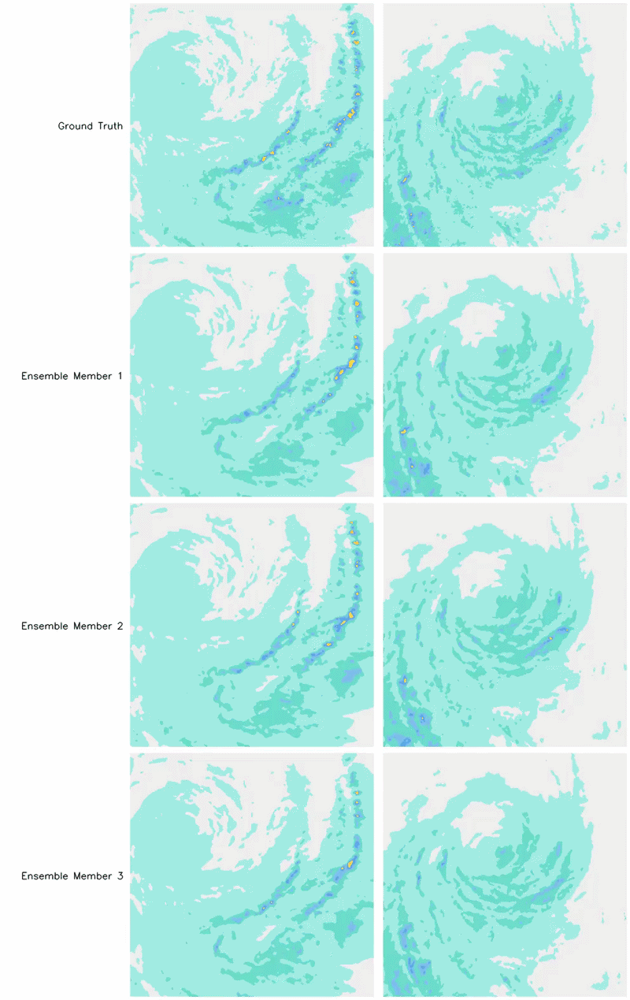

<p align="center">
 <h2 align="center">Probabilistic Precipitation Nowcasting with Rectified Flow Transformers</h2>
 <p align="center">
 <b>
 Johannes Schusterbauer<sup>*</sup> · Jannik Wiese<sup>*</sup> · Nick Stracke · Timy Phan · Björn Ommer
 </b>
 <p align="center"> 
    CompVis Group @ LMU Munich, Munich Center for Machine Learning (MCML)
 </p>
 <p align="center"> 
    CVPR 2026
 </p>
</p>
 </p>
<div align="center">


[](https://compvis.github.io/weather-rf/)
[-b31b1b)](_blank)
[](https://huggingface.co/CompVis/weather-rf)

<p align="center"> <sup>*</sup> <i>equal contribution</i> </p>

</div>

<p align="center">

</p>

Official code for the [paper](https://openaccess.thecvf.com//content/CVPR2026/papers/Schusterbauer_Probabilistic_Precipitation_Nowcasting_with_Rectified_Flow_Transformers_CVPR_2026_paper.pdf) "Probabilistic Precipitation Nowcasting with Rectified Flow Transformers" accepted at CVPR 2026.

## 💡 TL;DR

Weather forecasting requires probabilistic prediction. We propose a generative rectified-flow encoder–decoder for nowcasting with **uncertainty-aware compression**.
Our **Frame-wise encoder + unified decoder** (FREUD) architecture enables variable-length inputs, robustness to frame drops, and preserves temporal consistency.
We enable **simple training** - no loss weight tuning, only a simple, stable rectified flow objective.
A rectified-flow model in FREUD latent space achieves **state-of-the-art distributional and perceptual forecasting** quality.

## 📝 Overview 

<p align="center">

</p>

Our pipeline is built around **FREUD**, a first-stage model with a frame-wise transformer encoder and a united generative rectified flow decoder.
The *frame-wise encoder* processes each context frame independently, which prevents information leakage from future to past and supports incremental updates when new radar frames arrive.
The *united decoder* then reconstructs all frames jointly, improving temporal consistency and reducing artifacts that appear with purely frame-wise decoding. Because decoding is probabilistic, we can sample multiple reconstructions from the same latent representation and estimate decoding uncertainty through ensemble variance.
We regularize the latent space with a novel *stochastic tanh regularization*, producing bounded and smooth latents without relying on adversarial or perceptual losses.

On top of this first stage, we train a *latent-space rectified-flow forecasting model* with masking-based conditioning, allowing robust inference under variable numbers of observed input frames. During inference, we sample ensemble forecasts in latent space and decode them to pixel space, yielding calibrated, uncertainty-aware precipitation nowcasts. 

## 📊 Results

### 🗜️ Uncertainty-aware Compression

<p align="center">

</p>

Variance of reconstructions scales with precipitation intensity. Ensemble variance of decoder reconstructions provides a meaningful and localized uncertainty signal.

<p align="center">

</p>

### ⏳ Efficiency

<p align="center">

</p>

Our transformer-based compression stages is faster to run than CNN-based VAEs from prior work, while also using fewer parameters.

### ⛈️ Forecasting

<p align="center">

</p>

Forecasts remain realistic over time and ensemble members capture different plausible outcomes. Our pipeline captures complex dynamics of long-tail extreme weather events.

<p align="center">

</p>

<p align="center">

</p>

**For more insights please read our [paper](https://openaccess.thecvf.com//content/CVPR2026/papers/Schusterbauer_Probabilistic_Precipitation_Nowcasting_with_Rectified_Flow_Transformers_CVPR_2026_paper.pdf)**.

## ⚙️ Usage

### 🔧 Setup

1. Clone the repository:

```bash
git clone https://github.com/CompVis/weather-rf
cd weather-rf
```

2. Download model weights:

Download the model weights from 🤗 huggingface:

```bash
hf download CompVis/weather-rf --include "*.pt" --local-dir ckpts
```

3. Create a Python environment and install dependencies:

Conda (recommended):

```bash
conda create -n weather-rf python=3.12 -y
conda activate weather-rf
python -m pip install --upgrade pip
pip install -r requirements.txt
```

Virtual environment:

```bash
python3.12 -m venv .venv
source .venv/bin/activate
python -m pip install --upgrade pip
pip install -r requirements.txt
```

### 💽 Data

Our model is trained and evalauted using the [SEVIR](https://proceedings.neurips.cc/paper/2020/hash/fa78a16157fed00d7a80515818432169-Abstract.html) dataset.
You can download SEVIR h5 archives from aws [here](https://registry.opendata.aws/sevir/).
To download SEVIR you can for example install the aws CLI:
```bash
conda install awscli -c conda-forge
```
and then download the data by running:
```bash
aws s3 ls --no-sign-request s3://sevir/
```
We provide our train-test split in `data/test_data.txt`.

For evaluation we targeted consistency with [CasCast](https://github.com/OpenEarthLab/CasCast). Thus, we first extract `.npy` files from the `.h5` archives and then run evalaution with these. 
The preprocessed `.npy` data can be obtained using this snippet:
```python
import h5py
import numpy as np
from tqdm import tqdm

SAVE_PTH = './npy_data'
os.makedirs(SAVE_PTH, exist_ok=True)

currently_loaded_fname = ''
currently_loaded_data = None

for test_item in tqdm(test_list, desc='Saving Sequences'):
    h5_fname = test_item.split('-')[2]
    path_1 = test_item.split('-')[0]
    path_2 = test_item.split('-')[1]
    index_in_file = int(test_item.split('-')[3])
    frames_type = int(test_item.split('-')[4].split('.')[0])

    if frames_type == 0:
        frames = slice(0, 25)
    elif frames_type == 1:
        frames = slice(12, 37)
    elif frames_type == 2:
        frames = slice(24, 49)
    else:
        raise NotImplementedError(f'{frames_type} is not a valid identifier for frames')
    
    path_to_file = os.path.join(SEVIR_DATA_PATH, path_1, path_2, h5_fname)

    if currently_loaded_fname != h5_fname:
        with h5py.File(path_to_file, 'r') as h5file:
            currently_loaded_data = h5file['vil'][:]
        currently_loaded_fname = h5_fname

    vil_data = currently_loaded_data[index_in_file, :, :, frames]

    save_file_path = os.path.join(SAVE_PTH, 'test_2h/', test_item)
    np.save(save_file_path, vil_data)
```

For more information please refer to the [CasCast repository](https://github.com/OpenEarthLab/CasCast).

### 🏃 Inference

The notebook [notebooks/inference.ipynb](notebooks/inference.ipynb) contains code for obtaining both

- FREUD reconstructions and
- RaMViD latent-space forecasting (LSM)

Open it and update local paths (dataset + checkpoints) in the config cells.

For script-based evaluation, run:

```bash
python eval/eval_forecasting.py \
  --model_path checkpoints/lsm.ckpt \
  --sevir_npy_path <SEVIR_NPY_ROOT_PLACEHOLDER> \
  --txt_path data/test_data.txt
```

or to evaluate reconstruction quality run:

```bash
python eval/eval_freud_recon.py \
  --model_path checkpoints/freud.ckpt \
  --sevir_npy_path <SEVIR_NPY_ROOT_PLACEHOLDER> \
  --txt_path data/test_data.txt
```

### ⚠️ Original vs. Clean Implementation

Results in the paper were obtained using models trained with `torch==2.5.1`.
Due to changes in the behavior of `flex_attention`, we found checkpoints obtained with this version are **incompatible with newer PyTorch versions** and **highly sensitive to implementation details**.

Therefore, *we provide two implementations of our model*:
- **Clean**: In `model/` we provide a clean, easy-to-use, and easy-to-understand implementation of our models compatible with newer PyTorch versions. However, results may differ to results reported in the paper.
- **Original**: In `original_model/` we provide code to run the models we trained for the paper. These models **have to be run with `torch==2.5.1`** (see `original_requirements`). This implementation can be used to reproduce our results, yet might be fragile.

We provide an example of how to use the original implementation in `notebooks/original_inference.ipynb`. Some slight modification to the eval scripts is necessary to use them with the original models, yet core logic for evaluation is shared across both model versions.

We recommend using the `original_model` when exact reproduction/comparison is of essence and `model` when integrating components of our model into different pipelines.


## 🎓 Citation

If you use our work or parts thereof, please cite us accordingly: 

```bibtex
@inproceedings{schusterbauer2026weatherrf,
    title = {Probabilistic Precipitation Nowcasting with Rectified Flow Transformers},
    author = {Schusterbauer, Johannes and Wiese, Jannik and Stracke, Nick and Phan, Timy and Ommer, Bj{\"o}rn},
    booktitle = {Proceedings of the IEEE/CVF Conference on Computer Vision and Pattern Recognition},
    year = {2026}
}
```
